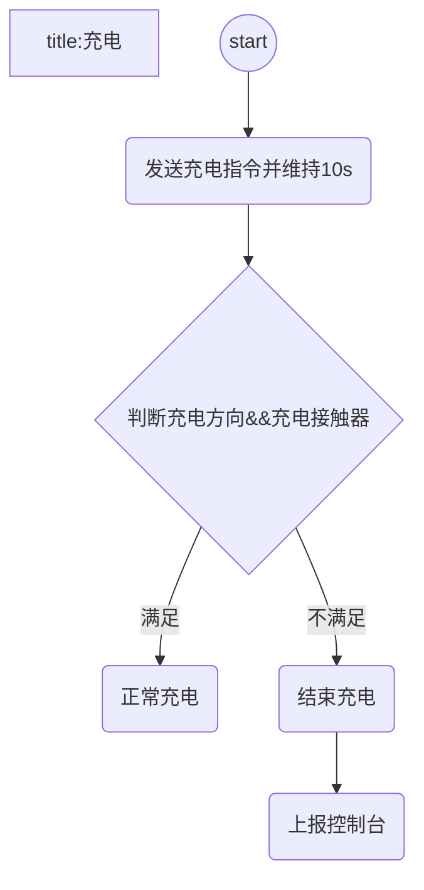
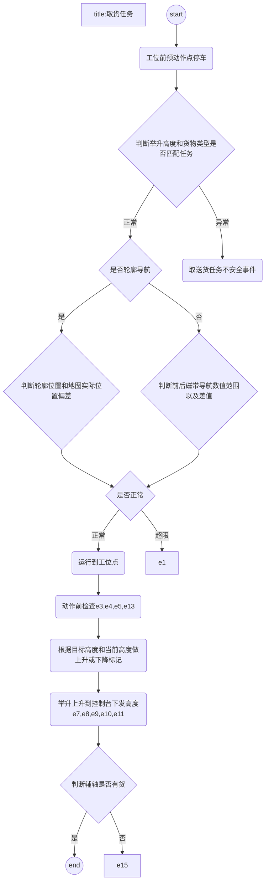
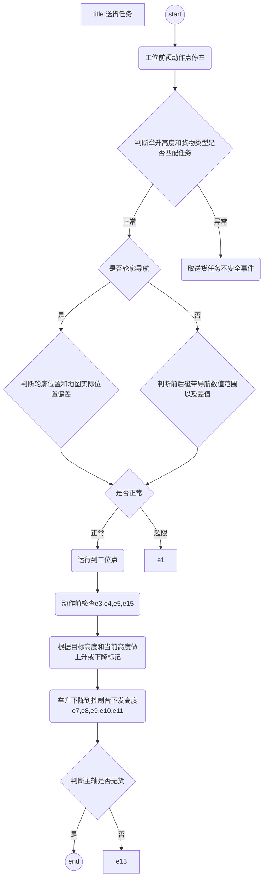
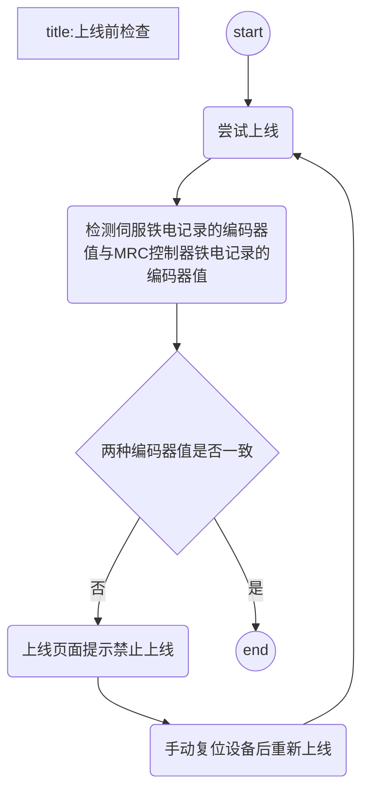
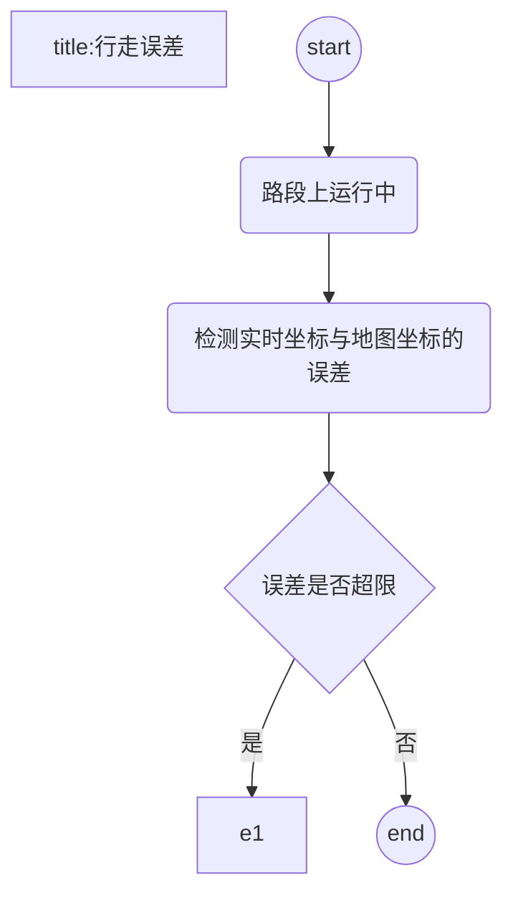
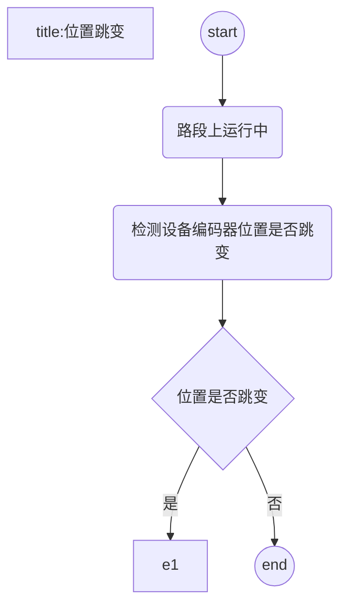
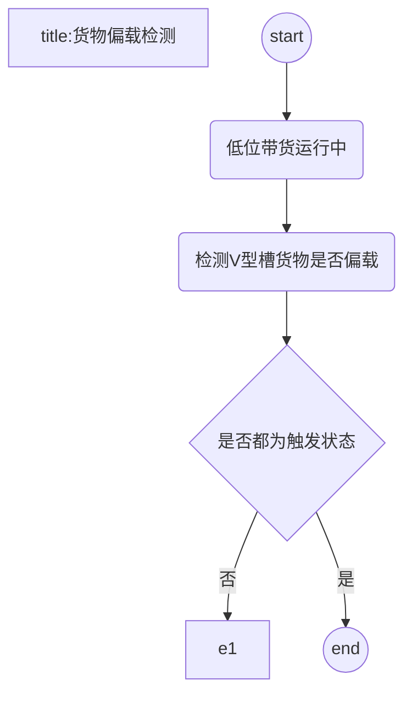
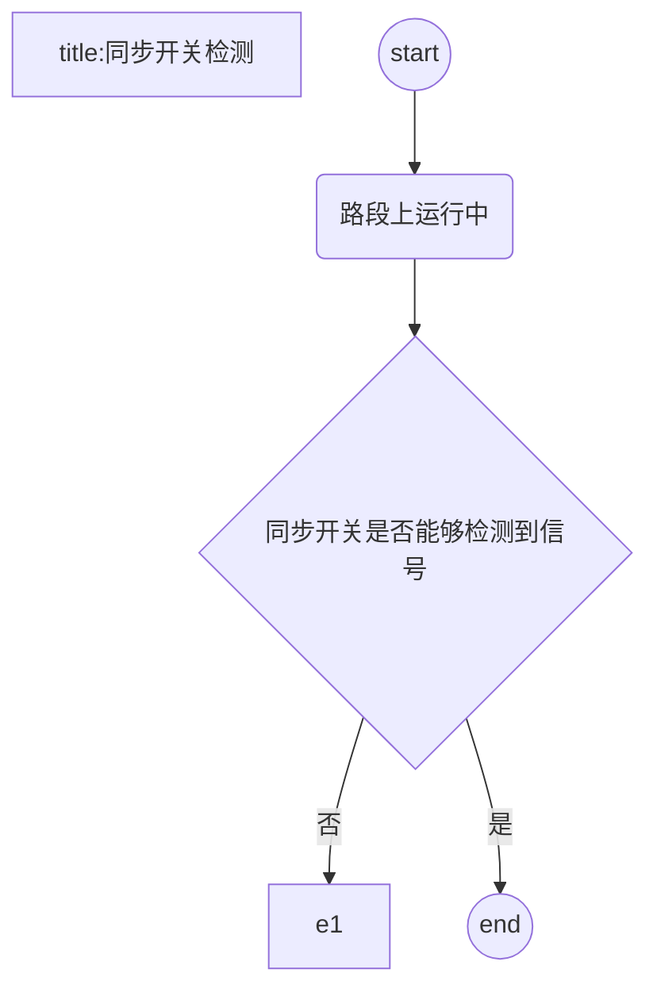
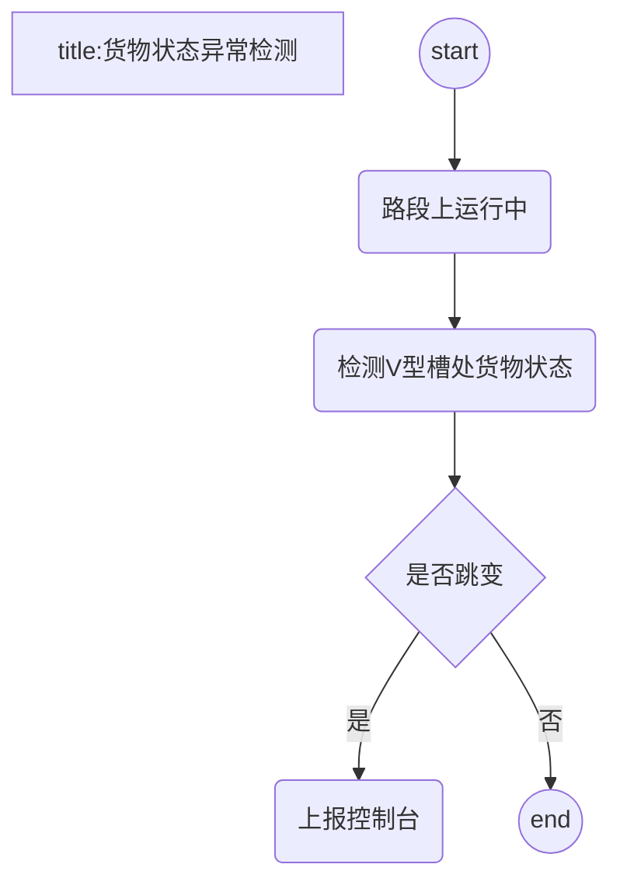
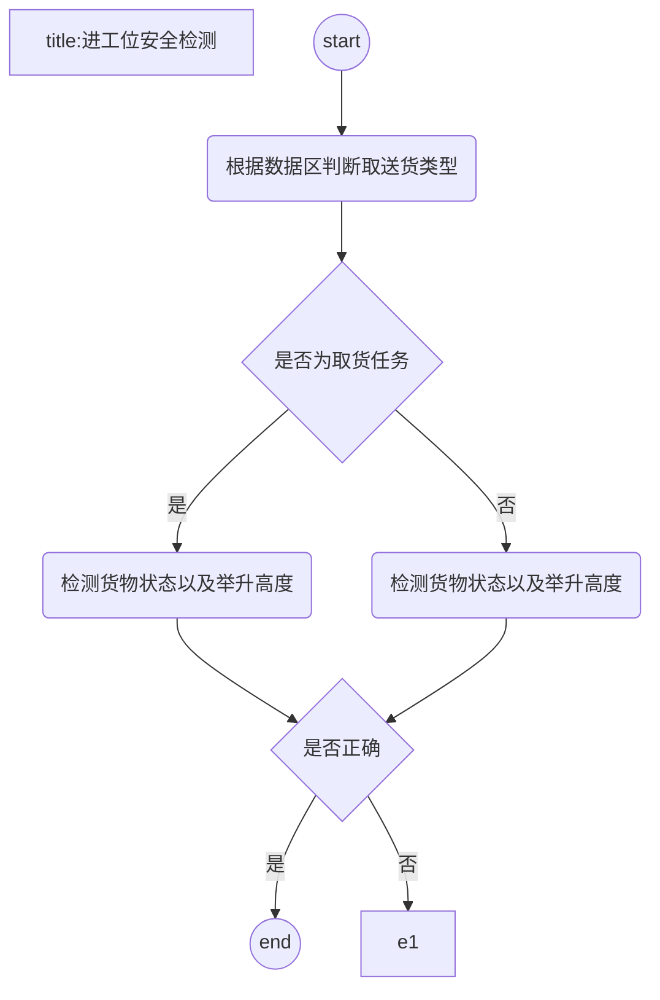

# V型槽

[toc]

## 任务流程

### 1 充电

### 2 取货任务

#### 2.1 主轴取满卷

|保护|名称|
|---|---|
|e1|导航误差超限|
|e2|左右磁导航偏差过大|
|e3|未发现地标|
|e4|举升任务高度错误|
|e5|举升伺服故障|
|e6|整体轴伺服报错|
|e7|举升编码器同步错误|
|e8|同步开关错误|
|e9|位置开关校验高度错误|
|e10|高度校验位置开关错误|
|e11|副轴货物状态异常|
|e12|主轴货物状态异常|
|e13|副轴货物存在|
|e14|主轴货物存在|
|e15|副轴货物不存在|
|e16|主轴货物不存在|

#### 2.2 辅轴取空卷

|保护|名称|
|---|---|
|e1|导航误差超限|
|e2|左右磁导航偏差过大|
|e3|未发现地标|
|e4|举升任务高度错误|
|e5|举升伺服故障|
|e6|整体轴伺服报错|
|e7|举升编码器同步错误|
|e8|同步开关错误|
|e9|位置开关校验高度错误|
|e10|高度校验位置开关错误|
|e11|副轴货物状态异常|
|e12|主轴货物状态异常|
|e13|副轴货物存在|
|e14|主轴货物存在|
|e15|副轴货物不存在|
|e16|主轴货物不存在|

### 3 送货任务

#### 3.1 主轴送满卷

|保护|名称|
|---|---|
|e1|导航误差超限|
|e2|左右磁导航偏差过大|
|e3|未发现地标|
|e4|举升任务高度错误|
|e5|举升伺服故障|
|e6|整体轴伺服报错|
|e7|举升编码器同步错误|
|e8|同步开关错误|
|e9|位置开关校验高度错误|
|e10|高度校验位置开关错误|
|e11|副轴货物状态异常|
|e12|主轴货物状态异常|
|e13|副轴货物存在|
|e14|主轴货物存在|
|e15|副轴货物不存在|
|e16|主轴货物不存在|

#### 3.2 辅轴送空卷

|保护|名称|
|---|---|
|e1|导航误差超限|
|e2|左右磁导航偏差过大|
|e3|未发现地标|
|e4|举升任务高度错误|
|e5|举升伺服故障|
|e6|整体轴伺服报错|
|e7|举升编码器同步错误|
|e8|同步开关错误|
|e9|位置开关校验高度错误|
|e10|高度校验位置开关错误|
|e11|副轴货物状态异常|
|e12|主轴货物状态异常|
|e13|副轴货物存在|
|e14|主轴货物存在|
|e15|副轴货物不存在|
|e16|主轴货物不存在|

## 异常保护

### 1 行走保护

#### 1.1 上线前检测

#### 1.2 行走误差

|保护|名称|
|---|---|
|e1|导航误差超限|

#### 1.3 位置跳变

|保护|名称|
|---|---|
|e1|设备伺服位置异常|

#### 1.4 货物偏载检测

|保护|名称|
|---|---|
|e1|V槽货物偏载|

#### 1.5 同步开关检测

|保护|名称|
|---|---|
|e1|同步开关错误|

#### 1.6 货物状态异常检测

|保护|名称|
|---|---|
|e1|货物状态跳变|

#### 1.7 进工位安全检测

|保护|名称|
|---|---|
|e1|取送货任务不安全|

### 2 取货保护

|保护|名称|
|---|---|
|e1|举升伺服未上电|
|e2|急停按下|
|e3|未发现地标|
|e4|左右磁导航偏差过大|
|e5|举升伺服故障|
|e6|整体轴伺服报错|
|e7|举升编码器同步错误|
|e8|同步开关错误|
|e9|位置开关校验高度错误|
|e10|高度校验位置开关错误|
|e11|举升任务高度错误|
|e12|副轴货物状态异常|
|e13|主轴货物状态异常|
|e14|副轴货物存在|
|e15|主轴货物存在|
|e16|副轴货物不存在|
|e17|主轴货物不存在|

### 3 送货保护

|保护|名称|
|---|---|
|e1|举升伺服未上电|
|e2|急停按下|
|e3|未发现地标|
|e4|左右磁导航偏差过大|
|e5|举升伺服故障|
|e6|整体轴伺服报错|
|e7|举升编码器同步错误|
|e8|同步开关错误|
|e9|位置开关校验高度错误|
|e10|高度校验位置开关错误|
|e11|举升任务高度错误|
|e12|副轴货物状态异常|
|e13|主轴货物状态异常|
|e14|副轴货物存在|
|e15|主轴货物存在|
|e16|副轴货物不存在|
|e17|主轴货物不存在|
